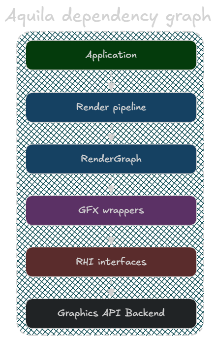

# Aquila Engine

Aquila is a modular C++ game engine built on Vulkan. It is organized as a strict layer stack — each layer depends only on the layers below it. The rendering architecture centers on a **retained-mode Render Graph** that drives a pipeline assembled from swappable rendering systems.

---

## Layer Map

| Layer | Location | Responsibility |
|-------|----------|----------------|
| **Application** | `Application/` | Main loop, windowing, event dispatch, resize |
| **RenderPipeline** | `Rendering/` | Frame orchestration, renderer composition |
| **Scene** | `Scene/` | ECS via EnTT, transform hierarchy, cameras |
| **RenderGraph** | `Graphics/RenderGraph/` | Dependency analysis, barrier inference, resource aliasing |
| **GFX** | `GFX/` | User-facing GPU objects (`GfxContext`, `GfxTexture`, …) |
| **RHI** | `RHI/Backend/` | Abstract GPU interfaces (backend-agnostic) |
| **Vulkan** | `RHI/Vulkan/` | Concrete Vulkan implementation of all RHI types |
| **Foundation** | `Foundation/` | Primitive types, smart pointers, logging, UUID |

---

## Pages

| Page | What's in it |
|------|-------------|
| [Foundation](Foundation.md) | Primitive types, smart pointers, macros, UUID, logging |
| [RHI](RHI.md) | Backend interfaces, Vulkan implementation, DeletionQueue |
| [GFX](GFX.md) | GfxContext, GfxCommandList, GfxTexture — the C++ GPU API |
| [Render Graph](Render-Graph.md) | Graph architecture, compilation pipeline, execution model |
| [RenderGraph Usage Guide](RENDERGRAPH.md) | Code snippets — how to write rendering systems and passes |
| [Rendering Systems](Rendering-Systems.md) | RenderPipeline, IRenderer, IRenderingSystem, all built-in systems |
| [Scene & ECS](Scene-ECS.md) | Scene, Entity, TransformComponent, MeshComponent, CameraComponent |
| [UI System](UI-System.md) | Canvas, View hierarchy, ViewSystem, style system |
| [Application](Application.md) | Application class, main loop, events, resize, lifecycle hooks |
| [Asset System](Asset-System.md) | AssetManager, Mesh, Texture2D |
| [Key Patterns](Key-Patterns.md) | Ownership conventions, resource lifetime, versioning, thread safety |
