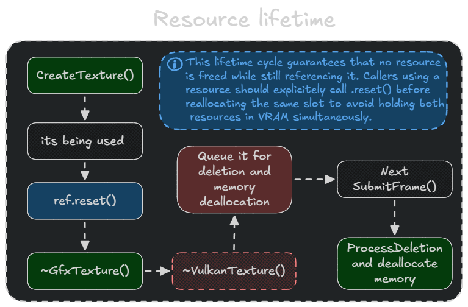

# Key Patterns & Invariants

This document consolidates the ownership conventions, GPU resource lifetime model, and architectural invariants that apply across the entire Aquila codebase.

---

## Ownership Convention

| Type | Meaning |
|------|---------|
| `Unique<T>` | Single owner. Used for subsystems, RHI resources inside GFX wrappers. |
| `Ref<T>` | Shared. Used for GPU resources visible to multiple systems (meshes, textures, pipelines). |
| Raw pointer / reference | Non-owning borrow. Caller guarantees lifetime. |

Never store a raw pointer to a resource whose `Ref` might be reset elsewhere without coordination.

---

## Resource Lifetime



---

## Why DeletionQueue

Vulkan does not allow destroying a resource while the GPU has pending work referencing it. Naively calling `vkDestroyImage` inside a destructor — triggered by a `Ref` dropping to zero — is unsafe if the GPU is mid-frame.

The deletion queue solves this by deferring the actual Vulkan destroy calls until after the GPU finishes the current frame.

### The Three-Phase Pattern

```
Phase 1 — Queue:   Resource destructor calls queue.QueueDeletion(handle)
                   (safe to call any time, just enqueues)

Phase 2 — Fence:   SubmitFrame() waits on per-frame VkFence
                   (guarantees GPU has executed all submitted commands)

Phase 3 — Process: ProcessDeletions() destroys all queued handles
                   (safe because GPU is past all uses)
```

### Special Case: Resize

During resize, `WaitIdle()` provides a stronger guarantee — all GPU work on all queues is done. `ProcessPendingDeletions()` is called immediately after resize so old swapchain images and render targets are freed before new ones are created, avoiding peak VRAM = 2× steady-state.

### Flush (Shutdown Path)

`DeletionQueue::~DeletionQueue()` calls `Flush()`, which calls `Wait()` (`vkDeviceWaitIdle`) then `ProcessDeletions()`. This is the safe teardown path when the entire device is being destroyed.

---

## Render Graph Version Tracking

Every `WriteTexture()` / `WriteBuffer()` call returns a *new* versioned handle. Passing a stale handle to a downstream pass that expects the written version will be caught at compile time (type mismatch or missing dependency edge).

```cpp
hColor_v0 = graph.ImportTexture(sceneColor, "SceneColor");
hColor_v1 = builder.SetColorAttachment(0, hColor_v0, Load::Clear, ...);  // geometry pass
hColor_v2 = builder.SetColorAttachment(0, hColor_v1, Load::Load, ...);   // lighting pass
hColor_v3 = builder.WriteTexture(hColor_v2, ShaderWrite);                 // composite pass
```

The graph refuses to compile if `hColor_v1` (written by geometry) is read before geometry runs.

---

## Thread-local Command Pools

`VulkanDevice::GetOrCreateThreadLocalGraphicsPool()` returns a `VkCommandPool` tied to the calling thread's ID. Command buffers recorded on different threads use different pools, eliminating per-record mutex contention. The pool map itself is protected by `m_ThreadPoolMapMutex` — accessed once per new thread, then cached in `thread_local` storage.

---

## Sampler Cache

`VulkanDevice::GetOrCreateSampler(SamplerDesc)` deduplicates samplers. `SamplerDesc` is hashable via a custom `SamplerDescHash`. All textures that share the same filter/wrap configuration reuse the same `VkSampler`. The sampler is owned by the device, not the texture — never destroy a sampler retrieved from the cache.

---

## Per-System Descriptor Versioning

`RenderingSystemBase` tracks a `needsUpdate[MAX_FRAMES_IN_FLIGHT]` flag per scene. Calling `MarkSceneDescriptorsDirty()` causes all per-frame slots to be re-written on the next frame they are used, rather than updating all at once. This avoids redundant descriptor writes when scene content has not changed.

---

## Transform Dirty Cache

World matrices are cached inside `TransformComponent`. A dirty flag is set when the local transform changes or when a parent's world matrix changes. `UpdateTransformHierarchy()` must be called once per frame — before any system reads world positions — to propagate changes top-down. `GetWorldMatrixLazy()` triggers a single-node update for out-of-render-loop queries.

---

## Immediate Destruction

For cases where deferred deletion is not acceptable (e.g. explicit resource eviction), `IRHIDevice` exposes:

```cpp
void DestroyTextureImmediate(IRHITexture& texture);
```

The caller is responsible for ensuring the GPU is idle (via `WaitIdle()` or a completed fence) before calling this. The implementation calls `VulkanTexture::DestroyImmediate()`, which zeroes out all handles so the destructor's null checks prevent a subsequent double-queue via the deletion queue.