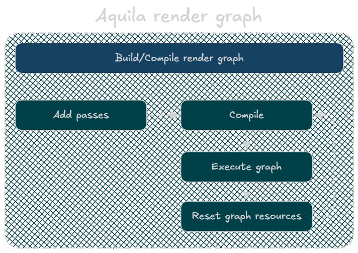

# RenderGraph Usage Guide

## The Three Phases

Every frame, every pass goes through the same three phases:



`RenderPipeline::Render()` handles Compile / Execute / Reset. You only write `AddPasses()`.

---

## Conventions

### 1. Handle versioning — the most important rule

Every `WriteTexture`, `SetColorAttachment`, or `SetDepthAttachment` (with `readOnly = false`) call returns a **new versioned handle**. You must replace your local handle with it. If you don't, downstream passes read a stale version and the graph's dependency tracking breaks.

```cpp
// WRONG — handle not updated, downstream sees version 0
builder.SetColorAttachment(0, ctx.hSceneColor, ...);

// CORRECT — always assign back
ctx.hSceneColor = builder.SetColorAttachment(0, ctx.hSceneColor, ...);
```

`SetDepthAttachment` with `readOnly = true` does not version — you can skip the assignment.

### 2. Setup lambda vs execute lambda

The **setup lambda** runs synchronously when `AddPass` is called. Use it only to declare resource accesses via the builder. No GPU work here.

The **execute lambda** runs during `Execute()`. This is where you call `cmd.*`. The registry is live here — physical resources are resolved via `reg.GetTexture(handle)`.

### 3. Collect draw calls in AddPasses, not in the execute lambda

The execute lambda runs later, but the scene state (ECS views, transforms) is from the `AddPasses` call. Capture everything you need by value (or by move) into the execute closure.

```cpp
std::vector<DrawCall> drawCalls = CollectFromScene(ctx);

graph.AddPass("MyPass",
    [&ctx](RG::RGPassBuilder &builder) { /* declare accesses */ },
    [this, drawCalls = std::move(drawCalls)](GFX::GfxCommandList &cmd, RG::RGRegistry &reg) {
        // draw calls are safely owned by the lambda
    });
```

### 4. Transient vs imported resources

| Kind | Created by | Lifetime | Use for |
|------|-----------|----------|---------|
| **Imported** | You, outside the graph | Yours to manage | Persistent targets — `m_SceneColor`, `m_DepthTex`, swapchain |
| **Transient** | `graph.DeclareTexture()` | Graph owns it, freed on `Reset()` | Intermediate targets that only exist within a frame |

### 5. Side effects

If your pass writes to an external resource the graph can't track (swapchain image, persistent output buffer), call `builder.MarkAsSideEffect()`. Without it the culling step may eliminate your pass if it sees no live graph outputs.

---

## 1. Minimal rendering system skeleton

```cpp
// MyRenderingSystem.h
#pragma once
#include "Aquila/Rendering/Systems/Base/IRenderingSystem.h"
#include "Aquila/GFX/GfxPipeline.h"

namespace Aquila::Rendering {

class MyRenderingSystem : public IRenderingSystem {
public:
    void OnInit(GFX::GfxContext &ctx) override;
    void AddPasses(Graphics::RG::RenderGraph &graph, FrameContext &ctx) override;
    void OnShutdown() override;

private:
    Ref<GFX::GfxPipeline> m_Pipeline;
};

} // namespace Aquila::Rendering
```

```cpp
// MyRenderingSystem.cpp
#include "MyRenderingSystem.h"
#include "Aquila/Rendering/FrameContext.h"
#include "Aquila/GFX/GfxContext.h"
#include "Aquila/GFX/GfxCommandList.h"
#include "Aquila/Graphics/RenderGraph/RGGraph.h"
#include "Aquila/Graphics/RenderGraph/RGPassBuilder.h"
#include "Aquila/RHI/Vulkan/VulkanShaderCompiler.h"
#include "Aquila/Foundation/SharedConstants.h"

namespace Aquila::Rendering {
using namespace Graphics;
using Aquila::SharedConstants::kShadersDir;

void MyRenderingSystem::OnInit(GFX::GfxContext &ctx) {
    std::vector<RHI::VulkanCompiledStage> stages;
    std::string err;
    if (!RHI::VulkanShaderCompiler::CompileFile(kShadersDir + "MyShader.slang", stages, err)) {
        AQUILA_LOG_ERROR("MyRenderingSystem: shader compile failed: {}", err);
        return;
    }

    RHI::GraphicsPipelineDesc desc{};
    for (auto &stage : stages) {
        RHI::ShaderStageDesc sd{ .spirv = stage.spirv, .entryPoint = stage.entryPointName };
        if (stage.stage == VK_SHADER_STAGE_VERTEX_BIT) {
            sd.stage = RHI::ShaderStageFlags::Vertex;
            desc.vertexShader = sd;
        } else {
            sd.stage = RHI::ShaderStageFlags::Fragment;
            desc.fragmentShader = sd;
        }
    }

    desc.colorFormats     = { RHI::TextureFormat::RGBA16F };
    desc.depthFormat      = RHI::TextureFormat::Depth32;
    desc.topology         = RHI::PrimitiveTopology::TriangleList;
    desc.raster.cullMode  = RHI::CullMode::Back;
    desc.raster.frontFace = RHI::FrontFace::Clockwise;
    desc.depthStencil.depthTest  = true;
    desc.depthStencil.depthWrite = false;

    m_Pipeline = ctx.CreateGraphicsPipeline(desc);
}

void MyRenderingSystem::AddPasses(RG::RenderGraph &graph, FrameContext &ctx) {
    if (!m_Pipeline) return;

    graph.AddPass(
        "MyPass",
        [&ctx](RG::RGPassBuilder &builder) {
            ctx.hSceneColor = builder.SetColorAttachment(
                0, ctx.hSceneColor,
                RG::AttachmentLoadOp::Load,
                RG::AttachmentStoreOp::Store);

            builder.SetDepthAttachment(
                ctx.hDepth,
                RG::AttachmentLoadOp::Load,
                RG::AttachmentStoreOp::Store,
                RG::AttachmentLoadOp::DontCare,
                RG::AttachmentStoreOp::DontCare,
                /*readOnly=*/true); // depth test, no depth write
        },
        [this](GFX::GfxCommandList &cmd, RG::RGRegistry &) {
            cmd.BindPipeline(*m_Pipeline);
            cmd.Draw(3); // replace with real draws
        });
}

void MyRenderingSystem::OnShutdown() {
    m_Pipeline.reset();
}

} // namespace Aquila::Rendering
```

---

## 2. Push constants

Define a plain struct. Declare the range once in the pipeline desc, then push per draw in the execute lambda.

```cpp
struct MyPushConstants {
    mat4  mvp;        // offset  0, 64 bytes
    vec4  color;      // offset 64, 16 bytes
    float roughness;  // offset 80,  4 bytes
    float metallic;   // offset 84,  4 bytes
};

// In OnInit — declare the range:
desc.pushConstants = { {
    RHI::ShaderStageFlags::Vertex | RHI::ShaderStageFlags::Fragment,
    /*offset=*/0,
    sizeof(MyPushConstants)
} };

// In the execute lambda — push per object:
MyPushConstants pc{
    .mvp       = ctx.viewProjection * worldMatrix,
    .color     = vec4(1.f, 0.5f, 0.2f, 1.f),
    .roughness = 0.4f,
    .metallic  = 0.8f,
};
cmd.PushConstants(pc, RHI::ShaderStageFlags::Vertex | RHI::ShaderStageFlags::Fragment);
```

---

## 3. Transient textures (frame-local intermediates)

Declare in `AddPasses`, use the handle in the same or a later pass. The graph allocates and frees the GPU memory automatically — you never call `CreateTexture` for these.

```cpp
void MyRenderingSystem::AddPasses(RG::RenderGraph &graph, FrameContext &ctx) {

    RG::RGTextureHandle hBlur = graph.DeclareTexture({
        .width     = ctx.width  / 2,
        .height    = ctx.height / 2,
        .format    = RHI::TextureFormat::RGBA16F,
        .usage     = RHI::TextureUsage::ColorAttachment | RHI::TextureUsage::Sampled,
        .debugName = "MyBlurTarget",
    });

    // Pass 1 — downsample SceneColor into the transient target
    graph.AddPass(
        "MyBlurDownsample",
        [&ctx, &hBlur](RG::RGPassBuilder &builder) {
            builder.ReadTexture(ctx.hSceneColor, RG::ResourceState::ShaderRead);
            hBlur = builder.SetColorAttachment(0, hBlur,
                RG::AttachmentLoadOp::DontCare,
                RG::AttachmentStoreOp::Store);
        },
        [this](GFX::GfxCommandList &cmd, RG::RGRegistry &) {
            cmd.BindPipeline(*m_DownsamplePipeline);
            cmd.Draw(3);
        });

    // Pass 2 — read the blurred result and composite back onto SceneColor
    graph.AddPass(
        "MyBlurComposite",
        [&ctx, &hBlur](RG::RGPassBuilder &builder) {
            builder.ReadTexture(hBlur, RG::ResourceState::ShaderRead);
            ctx.hSceneColor = builder.SetColorAttachment(0, ctx.hSceneColor,
                RG::AttachmentLoadOp::Load,
                RG::AttachmentStoreOp::Store);
        },
        [this, hBlur](GFX::GfxCommandList &cmd, RG::RGRegistry &reg) {
            GFX::GfxTexture &blurTex = reg.GetTexture(hBlur); // resolve at execute time
            m_DescriptorSet->UpdateBinding(0, blurTex);

            cmd.BindPipeline(*m_CompositePipeline);
            cmd.BindDescriptorSet(0, *m_DescriptorSet);
            cmd.Draw(3);
        });
}
```

---

## 4. Sampling a texture (descriptor set)

```cpp
// In OnInit — create the layout and allocate the set:
m_Layout = ctx.CreateDescriptorSetLayout({
    .bindings = { {
        .binding = 0,
        .type    = RHI::DescriptorType::CombinedImageSampler,
        .count   = 1,
        .stages  = RHI::ShaderStageFlags::Fragment,
    } }
});
m_Set = ctx.AllocateDescriptorSet(*m_Layout);

// In the execute lambda — update the binding then draw:
GFX::GfxTexture &tex = reg.GetTexture(hMyTexture);
m_Set->UpdateBinding(0, tex);

cmd.BindPipeline(*m_Pipeline);
cmd.BindDescriptorSet(0, *m_Set);
cmd.Draw(3);
```

> **Why update every frame?** Transient textures may alias to different physical allocations each frame. Always call `UpdateBinding` inside the execute lambda, not in `OnInit`.

---

## 5. Drawing objects from the scene (vertex + index buffers)

If you inherit from `RenderingSystemBase` you get `GetOrUploadMesh()` for free — it lazily uploads mesh data to the GPU and caches it, so the same mesh is only uploaded once regardless of how many frames reference it.

```cpp
void MyRenderingSystem::AddPasses(RG::RenderGraph &graph, FrameContext &ctx) {
    if (!m_Pipeline) return;

    struct MyDrawCall {
        Ref<GFX::GfxMesh> gpuMesh;
        mat4               mvp;
        vec4               color;
    };

    std::vector<MyDrawCall> drawCalls;
    auto view = ctx.scene->GetRegistry().view<TransformComponent, MyObjectComponent>();
    drawCalls.reserve(view.size_hint());

    for (auto entity : view) {
        auto &transform = view.get<TransformComponent>(entity);
        auto &obj       = view.get<MyObjectComponent>(entity);
        if (!obj.mesh) continue;

        drawCalls.push_back({
            .gpuMesh = GetOrUploadMesh(obj.mesh),
            .mvp     = ctx.viewProjection * transform.GetWorldMatrix(),
            .color   = obj.color,
        });
    }

    graph.AddPass(
        "MyObjects",
        [&ctx](RG::RGPassBuilder &builder) {
            ctx.hSceneColor = builder.SetColorAttachment(0, ctx.hSceneColor,
                RG::AttachmentLoadOp::Load, RG::AttachmentStoreOp::Store);

            builder.SetDepthAttachment(ctx.hDepth,
                RG::AttachmentLoadOp::Load, RG::AttachmentStoreOp::Store,
                RG::AttachmentLoadOp::DontCare, RG::AttachmentStoreOp::DontCare,
                /*readOnly=*/true);
        },
        [this, drawCalls = std::move(drawCalls)](GFX::GfxCommandList &cmd, RG::RGRegistry &) {
            cmd.BindPipeline(*m_Pipeline);
            for (auto &dc : drawCalls) {
                MyPushConstants pc{ .mvp = dc.mvp, .color = dc.color };
                cmd.PushConstants(pc, RHI::ShaderStageFlags::Vertex | RHI::ShaderStageFlags::Fragment);
                cmd.BindVertexBuffer(dc.gpuMesh->GetVertexBuffer());
                cmd.BindIndexBuffer(dc.gpuMesh->GetIndexBuffer());
                cmd.DrawIndexed(dc.gpuMesh->GetIndexCount());
            }
        });
}
```

---

## 6. Fullscreen / post-process pass (no vertex input)

```cpp
// In OnInit — no vertex input, no depth, no culling:
desc.colorFormats    = { RHI::TextureFormat::RGBA16F };
desc.depthFormat     = {};
desc.raster.cullMode = RHI::CullMode::None;
desc.noVertexInput   = true; // vertex shader generates positions from gl_VertexIndex

// In AddPasses:
graph.AddPass(
    "MyPostProcess",
    [&ctx, &hPostTarget](RG::RGPassBuilder &builder) {
        builder.ReadTexture(ctx.hSceneColor, RG::ResourceState::ShaderRead);
        hPostTarget = builder.SetColorAttachment(0, hPostTarget,
            RG::AttachmentLoadOp::DontCare, RG::AttachmentStoreOp::Store);
    },
    [this, hSceneColor = ctx.hSceneColor](GFX::GfxCommandList &cmd, RG::RGRegistry &reg) {
        GFX::GfxTexture &input = reg.GetTexture(hSceneColor);
        m_Set->UpdateBinding(0, input);

        cmd.BindPipeline(*m_Pipeline);
        cmd.BindDescriptorSet(0, *m_Set);
        cmd.Draw(3);
    });
```

The vertex shader for a fullscreen triangle needs no VBO — it computes clip-space positions from `gl_VertexIndex` (0, 1, 2):

```glsl
// Slang / GLSL equivalent
float2 positions[3] = { float2(-1,-1), float2(3,-1), float2(-1,3) };
float2 uvs[3]       = { float2(0,0),   float2(2,0),  float2(0,2)  };
out.position = float4(positions[vertexIndex], 0, 1);
out.uv       = uvs[vertexIndex];
```

---

## 7. Registering a system into a renderer

Systems attach to a renderer (`Renderer` for 3D, `Renderer2D` for UI/2D). The renderer calls `AddPasses` on each of its systems in registration order, so order matters.

```cpp
// In SetupScene() or OnStart():
auto *renderer = m_RenderPipeline->GetRenderer<Rendering::Renderer>();

renderer->AddSystem<DepthPrepassSystem>();  // runs first  — writes depth
renderer->AddSystem<GeometrySystem>();      // runs second — reads depth (Load), writes color
renderer->AddSystem<MyRenderingSystem>();   // runs third  — can Load both color and depth
```

`AddPasses` runs across all systems before `AddFinalPasses` runs across all renderers, so your system will always execute before the swapchain blit.

---

## Quick reference

| What | How |
|------|-----|
| Declare transient texture | `graph.DeclareTexture({width, height, format, usage, debugName})` |
| Import persistent texture | `graph.ImportTexture(myTex.get(), "Name")` |
| Read a texture in a pass | `builder.ReadTexture(handle, ResourceState::ShaderRead)` |
| Write color attachment | `handle = builder.SetColorAttachment(slot, handle, loadOp, storeOp)` |
| Write depth attachment | `builder.SetDepthAttachment(handle, depthLoad, depthStore, ...)` |
| Depth test, no depth write | `SetDepthAttachment(..., readOnly = true)` |
| Clear on first write | `AttachmentLoadOp::Clear` + `ClearColor{...}` or `ClearDepth{...}` |
| Load previous contents | `AttachmentLoadOp::Load` |
| Discard previous contents | `AttachmentLoadOp::DontCare` |
| Prevent pass culling | `builder.MarkAsSideEffect()` |
| Get physical texture at execute time | `reg.GetTexture(handle)` |
| Push per-draw data | `cmd.PushConstants(myStruct, ShaderStageFlags::Vertex)` |
| Draw indexed mesh | `cmd.BindVertexBuffer` → `cmd.BindIndexBuffer` → `cmd.DrawIndexed(count)` |
| Fullscreen triangle | `cmd.Draw(3)` with `noVertexInput = true` pipeline |
| Debug GPU label | `cmd.PushDebugGroup("name")` / `cmd.PopDebugGroup()` |
